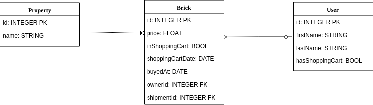
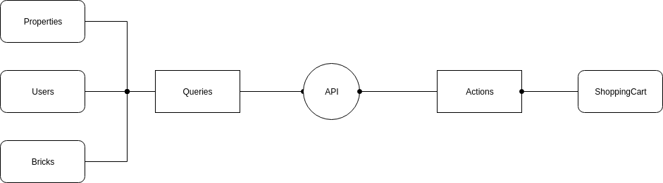

# Bricks Shopping Cart App

## Description

An App to buy bricks. Made with ❤ by Arath Jimenez.
 
## Stack

- MySQL
- Express
- React

## Installation

```bash
$ npm install
```

## Running the app

```bash
# Init database
# Mysql is required to be installed in OS before running any command of this project
$ npm run db:init
# Run app
$ npm run start
```

## Test

```bash
# Run server tests
# Note, it is needed to run to server by npm run start before executing tests
$ npm run test:server
```

## Important notes

The way the shopping cart works is described as following:

- Each brick is differente from each other, so each one has a unique identifier.
- A User can have as many bricks as needed.
- A Property can have as many bricks as needed.
- When a user adds a brick to it's shopping cart, the brick is separated from the available bricks.
- If another user attemps to add to it's shopping cart a brick that it's no longer available, the api returns an error.

## Environment Variables

It is required to add the next format to a .env file in order for the App to run properly.

```
# Server ENV variables
DB_USER=root
DB_PASS=root
DB_NAME=bricks-shopping-cart
DB_HOST=localhost

# Client ENV variables
NODE_PATH=src/
```

## Models and API architecture

- Models


- API architecure


## API Documentation

This project has an implementation of a REST API which runs in port 8080. The routes are described as following:

```
localhost:8080/api/users
This will return all users in database
GET method
```
```
localhost:8080/api/properties
This will return all properties in database
GET method
```
```
localhost:8080/api/bricks
This will return all bricks in database
GET method
```
```
localhost:8080/api/brick/:id
This will return a brick  by id
id is an integer
GET method

Example response
{
    "data": {
        "id": 2,
        "price": 512423,
        "inShoppingCart": false,
        "shoppingCartDate": null,
        "buyedAt": "2019-06-13T05:47:24.000Z",
        "ownerId": 1,
        "propertyId": 1,
        "createdAt": "2019-06-13T05:46:33.000Z",
        "updatedAt": "2019-06-13T05:47:24.000Z"
    }
}
```
```
localhost:8080/api/bricks/:data
This will return all bricks with filters
data is a json object with the following keys
GET method

data = {
    "available": BOOL, // request bricks with no owner
    "ownerId": INT, // request bricks by owner
    "propertyId": INT, // request bricks by property
    "inShoppingCart": BOOL // request bricks thar are in a shopping cart
}

Example request
localhost:8080/api/bricks/{"propertyId": 1}
It will return all bricks that belongs to property with id 1

Example response
{
    "data": [
        {
        "id": 1,
        "price": 51243,
        "inShoppingCart": false,
        "shoppingCartDate": null,
        "buyedAt": "2019-06-13T05:47:24.000Z",
        "ownerId": 1,
        "propertyId": 1,
        "createdAt": "2019-06-13T05:46:33.000Z",
        "updatedAt": "2019-06-13T05:47:24.000Z"
        },
        {
        "id": 2,
        "price": 512423,
        "inShoppingCart": false,
        "shoppingCartDate": null,
        "buyedAt": "2019-06-13T05:47:24.000Z",
        "ownerId": 1,
        "propertyId": 1,
        "createdAt": "2019-06-13T05:46:33.000Z",
        "updatedAt": "2019-06-13T05:47:24.000Z"
        }
    ]
}

```
```
localhost:8080/api/shoppingCart/add
This will add a brick to a shopping cart
PUT method

Request body structure
body = {
    userId: INT,
    brickId: INT
}
```
```
localhost:8080/api/shoppingCart/remove
This will remove a brick from a shopping cart
PUT method

Request body structure
body = {
    userId: INT,
    brickId: INT
}
```
```
localhost:8080/api/shoppingCart/clear
This will clear a user shopping cart
PUT method

Request body structure
body = {
    userId: INT
}
```
```
localhost:8080/api/shoppingCart/complete
This will finalize a purchase from a user
PUT method

Request body structure
body = {
    userId: INT
}
```

